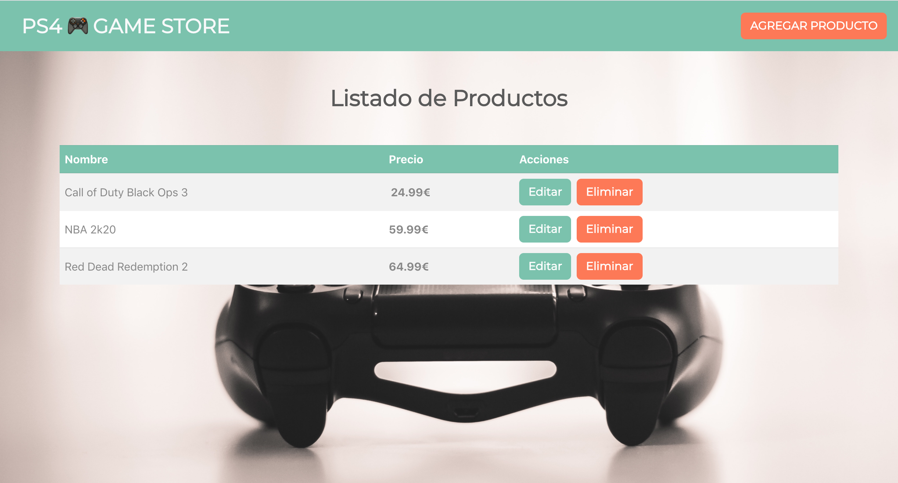

# CRUD - React, Redux, RestAPI & Axios



The aim of this project was to learn more deeply how to use Redux, concretely the typology: redux-thunk.

## Functional Description

User will have the chance to: create, edit and delete products. 

## Technical Description

Front-End part developed with: React with Redux, CSS.
Back-End part developed with: json-server (library that creates a fake API)
API requests done using Axios. 

## Follow the next steps

Have installed node (+npm)

Install the fake API server (json-server) globally, writting the following code: 
````
npm install -g json-server
````
Clone in your local the following repository: https://github.com/adricampo/games-store.git , and install the dependencies to continue with the process.

It is a must to have oppened two terminal windows in parallel:

1 - One with the React frontend part using:
````
npm run start 
````
2 - Another one with the fake-server backend using:
````
json-server db.json --port 4000
````
*as the frontend normally is using port 3000, it is important to atribute another one to the backend site. 

-------------
This project was bootstrapped with [Create React App](https://github.com/facebook/create-react-app).
